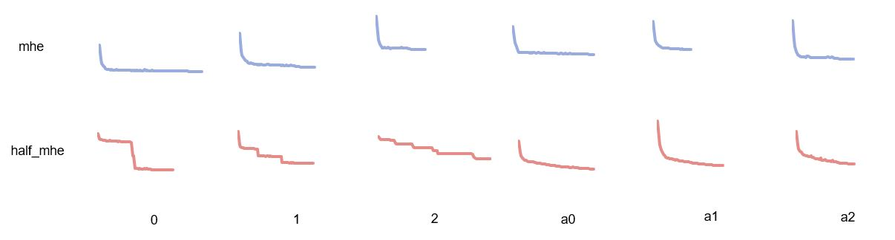

## Hyper-Wave-U-Net:
# Exploring Minimim Hyperspherical Energy for improving Singing Voice Separation with the Wave-U-Net

Based on: 
- The [Wave-U-Net](https://github.com/f90/Wave-U-Net) for audio source separation (Stoller et al., 2018).
- Implementation of [MHE](https://github.com/wy1iu/MHE) for deep learning models (Liu et al., 2018)

## What is the Wave-U-Net?
The Wave-U-Net is a convolutional neural network applicable to audio source separation tasks, which works directly on the raw audio waveform, presented in [this paper](https://arxiv.org/abs/1806.03185).

## What is MHE regularisation?
Recently introduced in [this paper](https://arxiv.org/abs/1805.09298), Minimum Hyperspherical Energy is a regularisation framework that reduces neuron redundancy through diversification. Inspired by a well-known physics problem, it searches for minimising the hyperspherical energy of the neuron configuration. A lower energy value implies that the neurons are more diverse and more uniformly spaced.



# Installation

## Requirements 

GPU strongly recommended to avoid very long training times.
The project is based on Python 2.7 and requires [libsndfile](http://mega-nerd.com/libsndfile/) to be installed.
Then, the following Python packages need to be installed:

```
numpy==1.15.4
sacred==0.7.3
tensorflow-gpu==1.8.0
librosa==0.6.2
soundfile==0.10.2
lxml==4.2.1
musdb==0.2.3
museval==0.2.0
google==2.0.1
protobuf==3.4.0
```

To install all the required packages at once:

``pip install -r requirements.txt``


### Download datasets

To reproduce the experiments (train all the models), you need to download the datasets below:

#### MUSDB18

Download the [full MUSDB18 dataset](https://sigsep.github.io/datasets/musdb.html) and extract it into a folder of your choice. It should have two subfolders: "test" and "train" as well as a README.md file.

#### CCMixter (only required for vocal separation experiments)

If you want to replicate the vocal separation experiments and not only the multi-instrument experiments, you also need to download the CCMixter vocal separation database from https://members.loria.fr/ALiutkus/kam/. Extract this dataset into a folder of your choice. Its main folder should contain one subfolder for each song.

### Set-up filepaths

Now, to set up the correct file paths for the datasets and the location where source estimates should be saved.

Open the ``Config.py`` file, and set the ``musdb_path`` entry of the ``model_config`` dictionary to the location of the main folder of the MUSDB18 dataset.
Also set the ``estimates_path`` entry of the same ``model_config`` dictionary to the path pointing to an empty folder where you want the final source estimates of the model to be saved into.

If you use CCMixter, open the ``CCMixter.xml`` in the main repository folder, and replace the given file path tagged as ``databaseFolderPath`` with your path to the main folder of CCMixter.

## Training the models / model overview

To train the models, run in a command prompt:
``python Training.py with cfg.configuration_name`` 

Replacing _configuration_name_ with a desired configuration. 


## Run pretrained models

For a quick demo on an example song with our pre-trained best vocal separation model (M5-HighSR), one can simply execute

`` python Predict.py with cfg.full_44KHz ``

to separate the song "Mallory" included in this repository's ``audio_examples`` subfolder into vocals and accompaniment. The output will be saved next to the input file.

To apply our pretrained model to any of your own songs, simply point to its audio file path using the ``input_path`` parameter:

`` python Predict.py with cfg.full_44KHz input_path="/mnt/medien/Daniel/Music/Dark Passion Play/Nightwish - Bye Bye Beautiful.mp3"``

If you want to save the predictions to a custom folder instead of where the input song is, just add the ``output_path`` parameter:

`` python Predict.py with cfg.full_44KHz input_path="/mnt/medien/Daniel/Music/Dark Passion Play/Nightwish - Bye Bye Beautiful.mp3" output_path="/home/daniel" ``

If you want to use other pre-trained models we provide (such as our multi-instrument separator) or your own ones, point to the location of the Tensorflow checkpoint file using the ``model_path`` parameter, making sure that the model configuration (here: ``full_multi_instrument``) matches with the model saved in the checkpoint. As an example for our pre-packaged multi-instrument model:

`` python Predict.py with cfg.full_multi_instrument model_path="checkpoints/full_multi_instrument/full_multi_instrument-134067" input_path="/mnt/medien/Daniel/Music/Dark Passion Play/Nightwish - Bye Bye Beautiful.mp3" output_path="/home/daniel" ``

# Known issues / Troubleshooting

MacOS: If matplotlib gives errors upon being imported, see [this issue](https://github.com/f90/Wave-U-Net/issues/15) and [that issue](https://github.com/f90/Wave-U-Net/issues/8) for solutions.  

During the preparation of the MUSDB dataset, conversion to WAV can sometimes halt because of an ffmpeg process freezing that is used within the musdb python package to identify the datasets mp4 audio streams. This seems to be an error occurring upon the subprocess.Popen() used deep within the stempeg library. Due to its random nature, it is not currently known how to fix this. I suggest regenerating the dataset again if this error occurs.
